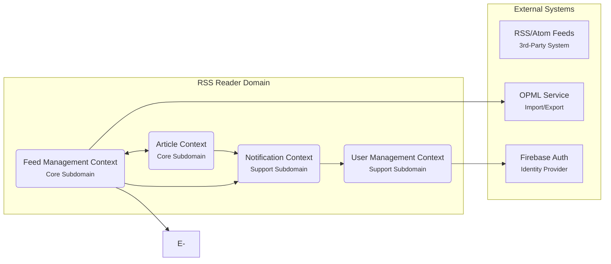

---

## **説明**

1. **Feed Management Context (Core Subdomain)**
   - RSS/Atomのフィードを登録・編集・削除する機能を担う中核のコンテキスト。
   - 外部のRSS/Atomフィード（E）やOPMLサービス（F）との連携がある。

2. **Article Context (Core Subdomain)**
   - 各フィードに紐づく記事（Article）の取得・格納・表示を扱うコンテキスト。
   - フィード情報（Feed Management Context）と連携しながら、取得済み記事や未読/既読管理、検索機能などを提供。

3. **User Management Context (Support Subdomain)**
   - ユーザープロファイル、認証、ユーザーごとの既読情報やブックマークなどを管理。
   - Firebase Auth（G）などの外部IDプロバイダと連携する場合、ここでアクセストークンの管理やログイン状態を扱う。

4. **Notification Context (Support Subdomain)**
   - 新着記事や特定キーワードの記事のプッシュ通知、購読フィードの更新通知などを扱う。
   - Article Context や Feed Management Context からのイベントをトリガーとして通知を送信。
   - ユーザー情報(User Management Context)と連携して、ユーザーごとの通知設定を管理。

---

### **コンテキスト間の関係性**

- **Feed Management Context** と **Article Context** は密接に連携している（パートナーシップの関係）。  
  - フィードの情報更新は記事の取り込みに影響し、逆に新しい記事の取得・管理ロジックはフィード情報を参照する。

- **Notification Context** は、主に **Feed Management Context** と **Article Context** からの更新イベントを参照して通知を生成する。  
  - 例: 新着記事があればユーザーへプッシュ通知を送る。

- **User Management Context** は主に認証やユーザープロファイルを管理し、各機能で「どのユーザーがアクセスしているか」を判断できるようトークンやユーザー情報を提供。

- **外部システム**  
  - **RSS/Atom Feeds(E)**: 不特定多数の外部サイト。Feed Management Context がこれらのフィードデータを取得する。  
  - **OPML Service(F)**: フィード一覧のインポート/エクスポート機能で連携する場合がある。  
  - **Firebase Auth(G)**: ユーザー認証の実装。User Management Context のサポートとして利用。

---

## **ポイント**

- **Core Subdomain**: プロダクトの価値や差別化の核となる領域。  
  - RSSリーダーの場合、**フィード管理**と**記事管理**がコアとなりやすい。  
- **Support Subdomain**: 認証や通知など、コアを補完する機能領域。  
- コンテキストマップはあくまで高レベルな図解です。実際にはユビキタス言語の洗練や、各コンテキスト内部のエンティティ・集約などをさらに詳細化すると、DDDを進めやすくなります。
